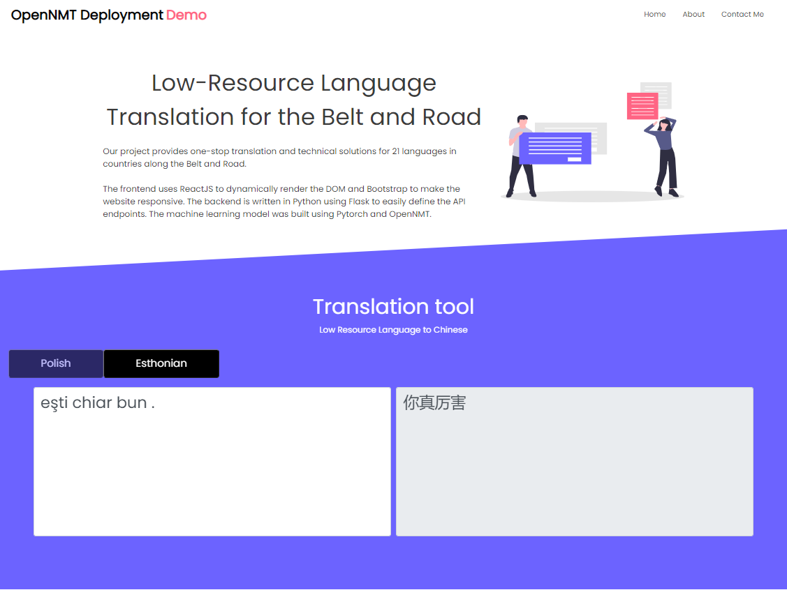

# NMT-React for Low resource Languages





This tool based under a Neural Machine Translation technology will help you translate Low resource languages to Chinese. The frontend uses ReactJS to dynamically render the DOM and Bootstrap to make the website responsive. The backend is written in Python using Flask to easily define the endpoints. The machine learning model was built using TensorFlow and OpenNMT.

## Getting Started

These instructions will get you a copy of the project up and running on your local machine for development and testing purposes.

### Prerequisites

First, you'll need to install pytorch OpenNMT-py ctranslate2, flask, flask_cors. It is highly recommended to install them in a virtual environment.

#### Back-End Environment
```
conda create -n nmt-flask python=3.6.2
conda activate nmt-flask
pip install --upgrade pip
conda install pytorch==1.6.0 torchvision==0.7.0 cudatoolkit=10.1 -c pytorch
pip install OpenNMT-py
pip install flask flask_cors 
```

#### Front-End Environment
Then you'll need to install the dependences for the frontend. We will use yarn instead of node because it downloads packages in parallel, which reduces the download time. 

```
node -v
npm -v  #make sure that you have node and npm 
yarn install
```
#### Model download

Currently we have two translation pretrained model of Polish and Romanian.

And we can download it from  [Jiaoda Yunpan](https://jbox.sjtu.edu.cn/l/v18BdF) and put it in `./api`

### Starting the Frontend

To start the frontend, simply go in the root of the project (`./nmt-react`) and type  `yarn start`.

### Starting the Backend

To start the frontend, simply go in the api folder of the project (`./nmt-react/api`) and type  `python server.py`.


## File structure
### api
In `pozhtranslator.py` & `rozhtranslator.py`, we define several translator Class, which are used to preprocess and translate based on exported models`./api/model`.

### node_modules
They are generated automatically after we run `yarn install`

### src & public

They are frontend folders based on React.

## Built With

* [create-react-app](https://github.com/facebook/create-react-app) - Toolkit to setup ReactJS
* [OpenNMT](https://opennmt.net/) - Machine Translation Tool
* [OpenNMT-py ](https://github.com/OpenNMT/OpenNMT-py) -OpenNMT Pytorch Version
* [Flask](https://github.com/pallets/flask) - Backend API

## Authors

* **Xinran Chen** - [JasmineChen123](https://github.com/JasmineChen123)

## License

This project is licensed under the MIT License - see the [LICENSE.md](LICENSE.md) file for details


